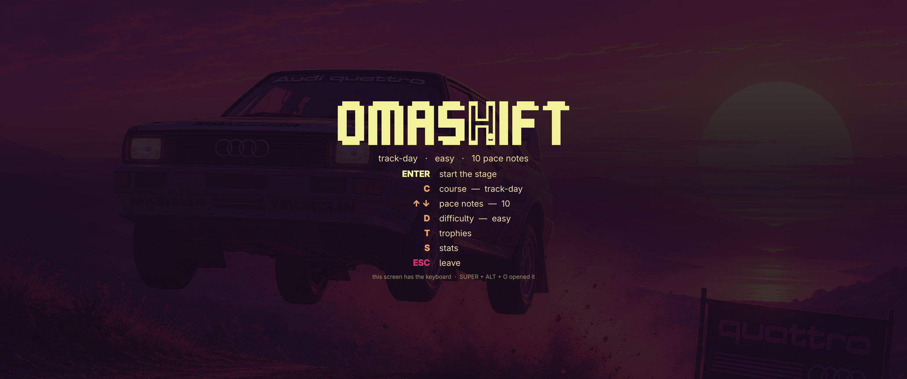
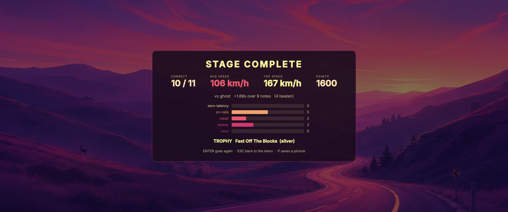
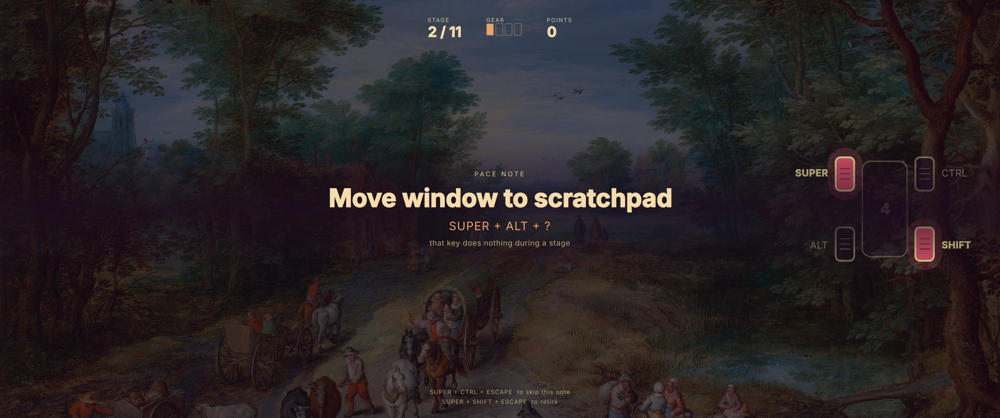
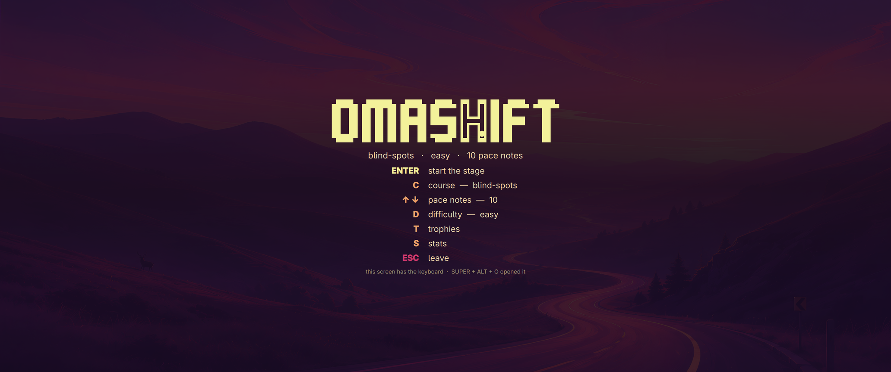
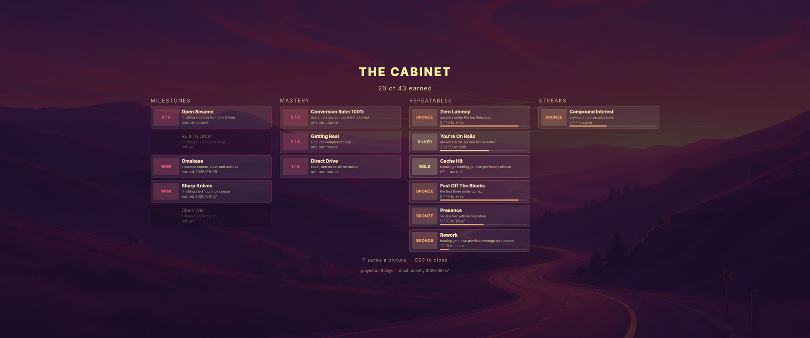
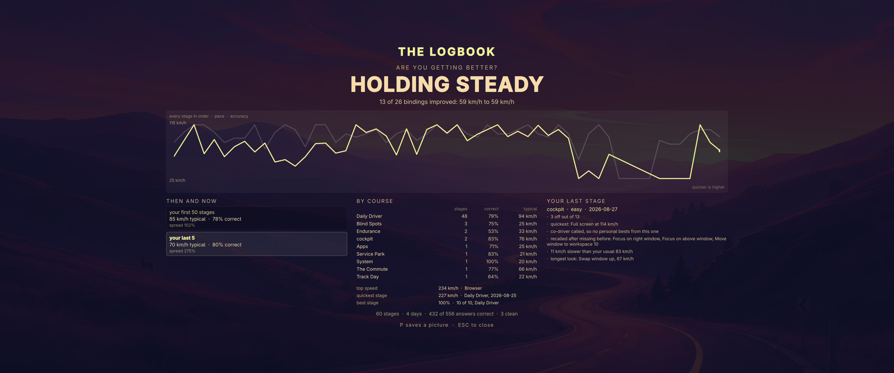

<picture>
  <source media="(prefers-color-scheme: dark)" srcset="assets/omashift-logo-dark.svg">
  
</picture>

**A rally game that helps you make the shift to Omarchy.**

Omashift reads the keybindings you actually have, then races you on them. A stage is a handful of pace notes: the game names an action, you press the chord, and your reaction time becomes a speed. Miss one and you go off, into the scenery. Get quick and you shift up.

It's born out of the original author's need to get better with keyboard shortcuts to make the most of Omarchy. But, instead of flashcards, it gives you a more fun way to get better.







---

## Why it exists

Switching desktops is not hard because the new one is worse. It is hard because for two weeks you are slower than you were, and that can be so frustrating. If you are good at using your current OS, it means there is a solid learning curve to get as good on the next OS.

Omashift is the shortcut through that frustration. It drills the bindings you have on the machine in front of you, it finds the ones you keep missing, and it makes the drilling worth doing twice.

## What you need

|            |                                                          |
| ---------- | -------------------------------------------------------- |
| Hyprland   | with the **Lua config** enabled, and `hyprctl` on `PATH` |
| Quickshell | draws the game                                           |
| Lua 5.4    | the engine                                               |
| jq         | reads your keymap into the question bank                 |
| Omarchy    | not required, but everything is aimed at it              |

Omarchy ships all of the above, which is why it is the target. On plain Hyprland with a Lua config it should run: nothing in the code knows what Omarchy is except the theme backdrops, and a machine without them falls back to a drawn sky. That path is untested. See [Known issues](#known-issues).

## Install

```bash
git clone https://github.com/omashift/omashift ~/src/omashift
cd ~/src/omashift
./install
```

`./install` links three commands onto your `PATH` and prints the one line to add to your Hyprland Lua config:

```lua
o.bind("SUPER + ALT + O", "Omashift", "omashift")
```

It also adds an entry to your app menu, so you can find Omashift without remembering the chord, and `./install --uninstall` takes it away again.

Nothing else is written to your config, which is why uninstalling is `hyprctl reload` and deleting the clone.

### As an Omarchy plugin

On Omarchy 4 the same repo installs as a shell plugin, which adds an Omashift
button to your bar:

```bash
omarchy plugin add https://github.com/omashift/omashift.git --enable
omarchy plugin update io.github.omashift.omashift   # later, to upgrade
```

There is no release to download and no package to build. The plugin system
clones the default branch and fast forwards it on update, so the tip of `main`
is what you get.

**Left click opens Omashift. Right click retires a stage.** One click cannot
take your keyboard: `omashift` on its own arms a stage and draws the menu, and
the stage starts only when you ask a second time. So a stray click costs you a
menu, never your keyboard. A second, deliberate click does start the stage,
exactly as pressing the launch chord twice does, and clicks inside the first
one's two and a half second startup are ignored so a double click cannot stage
the game twice.

Adding the plugin does not run `./install`, so it gives you the button and
nothing else. If you also want the `omashift` commands on your `PATH`, the app
menu entry and the launch chord, run `./install` from the plugin directory:

```bash
cd ~/.config/omarchy/plugins/io.github.omashift.omashift && ./install
```

To remove it:

```bash
omarchy plugin remove io.github.omashift.omashift
```

That deletes the checkout and takes the button off your bar. If you ran
`./install` from inside the plugin directory, run `./install --uninstall`
first, while the directory still exists.

The bar widget is the only piece of Omashift that runs inside `omarchy-shell`.
It draws a mark, reads one file, and spawns the launcher. The game itself is a
separate process, so a crash in a fullscreen game cannot take your bar and your
notifications with it.

## Play

`SUPER + ALT + O` opens the front screen. Your keybindings still work at this point, and the game is waiting on you.

| Key     |                          |
| ------- | ------------------------ |
| `ENTER` | start the stage          |
| `C`     | change course            |
| `D`     | change difficulty        |
| `↑` `↓` | more or fewer pace notes |
| `T`     | the trophy cabinet       |
| `S`     | the Logbook              |
| `ESC`   | leave                    |

Once a stage starts, the game has the keyboard. Every key goes to it and none of your bindings fire, which is the only way to test whether you know a chord without also running it. `SUPER + SHIFT + ESCAPE` retires the stage and hands everything back.

### During a stage

The game names an action. You press what you think it is bound to.

Fast answers score more and move you up the gearbox; a wrong answer is an **off**, and the game tells you what you actually pressed and what that does. If you sit still, the **co-driver** starts reading you in: first the modifiers, then the whole chord. A called note still trains and still scores, but it cannot set a personal best.

**If a key on the prompt is one your keyboard does not have, skip it.** Skip the same one twice and it leaves your rotation for good: no course will ask it again. That is announced on screen when it happens, and it is not one-way.

```bash
omashift --retired                  # what is out, and why
omashift --restore "Toggle waybar"  # put one back
omashift --restore --all            # put everything back
```

A skip is not a mistake and the game does not treat it as one. It costs no points, breaks no gear, and never feeds Blind Spots, because a chord you cannot produce is the one thing drilling can never teach you.

## Courses

A course is a slice of your keymap, matched on what each binding is described as doing. `omashift --courses` lists them.

In the order `C` offers them, which runs from the things you do constantly out to the ones you barely touch:

| Course       |                                                       |
| ------------ | ----------------------------------------------------- |
| Daily Driver | the dozen things you do constantly                    |
| The Commute  | several times a day                                   |
| Apps         | opening the things you actually use                   |
| Track Day    | weekly, shaping windows rather than just opening them |
| System       | menus, power, audio, notifications                    |
| Endurance    | rare, the far corners of the keymap                   |
| Blind Spots  | built from your own history                           |
| Service Park | the odd-shaped keys nobody remembers                  |

**Blind Spots are dynamic and help you get better by having you work on your weakest actions.** It is generated from what you have actually missed and what you get right but slowly, so it gets more useful the more you play and it is different for everybody.

**Write your own** in `~/.config/omashift/courses.lua`. They merge over the shipped ones and `C` reaches them like any other course, without the game being told they exist. Patterns are matched against binding **descriptions**, not key combos, so a course of your own survives you remapping the keys under it.

```lua
-- ~/.config/omashift/courses.lua
return {
  ["cockpit"] = {
    label = "Cockpit",
    note  = "where your windows sit, and which one you are in",
    scene = { theme = "retro-82", file = "4-gateway.jpg", scrim = 0.58 },
    patterns = {
      "^Focus on %a+ window$", "^Swap window", "^Move window to workspace",
      "^Toggle window floating", "^Full screen$", "^Close window$",
    },
  },
}
```

That is a real one, and it is the course the author plays: it cuts across Daily Driver and The Commute to drill window handling on its own, which no shipped course does. Give a course no usable patterns and it is refused out loud rather than quietly handing you the whole keymap.



Every course brings its own backdrop, read from the Omarchy theme already on your machine, and a course you write yourself can name one too: a theme you have, a file in its `backgrounds/`, and a `scrim` between 0 and 1 for how hard to dim it so the words stay readable. Leave `scene` out and the course wears the default picture. A theme you do not have falls back to a sky the game draws itself.

## The Cabinet and the Logbook

`T` opens the **Cabinet**: trophies won, and every trophy you have not won yet, dimmed rather than hidden, because an empty case is a map of what there is to do. Each one says what it takes to earn it.



`S` opens the **Logbook**, which answers one question and puts the answer in letters four times the size of anything else: are you getting better? The verdict comes from a paired comparison of the bindings you have answered in both your early stages and your recent ones, each against itself, so it survives you moving to a harder course. Under six stages it tells you how many more it needs rather than inventing a trend.



`P` **saves a picture** of either of them, and of the results page. `PRINT` works too, on the keyboards that have one, and plenty of compact boards do not. The game has to offer this itself: while any of those screens is up it holds the keyboard exclusively, which swallows your own screenshot binding along with every other global shortcut. The file goes to your pictures directory and onto the clipboard.

**A stage in progress needs a timer instead**, because there is no key left to press: the submap has replaced your whole keymap, so a key in the question bank is scored and every other key does nothing. Arm it first, then play.

```bash
omashift-snapshot --in 15 stage    # then launch a stage and be mid-note when it fires
```

Nothing is drawn before the shutter, so the countdown cannot photograph itself.

`omashift-stats` in a terminal is the deeper read: blind spots, every personal best, the full reaction ladder.

## It takes your keyboard, and how you get it back

While a stage runs, Omashift owns the keyboard. That is the feature. It also means a bug in it could leave you unable to type, so there are three ways out and they do not depend on each other:

1. `SUPER + SHIFT + ESCAPE` retires the stage immediately.
2. **Sixty seconds** with no keypress hands the keyboard back on its own. If you walked away, the game lets go.
3. **A ninety second watchdog** force-releases the keymap even if the engine has stopped answering, because it runs in the compositor rather than in the game.
4. **Your pointer**, if you installed the plugin above. Right click the bar widget to retire the stage. This is the only route that does not go through the keyboard at all, which matters because a stranded stage answers `SUPER + RETURN` as a pace note: there is no way to open a terminal from the keyboard, and the pointer is the only way back in.

**So if you are ever stuck, wait ninety seconds.** You do not need another machine, a phone, or a TTY. Nothing about this is permanent, and nothing is written to your Hyprland config at any point.

## Config

`~/.config/omashift/config`, all optional:

```ini
difficulty=medium        # easy | medium | hard
idle_release=60          # seconds of no input before the keyboard goes back
hint_mods=4000           # ms before the co-driver reads the modifiers
hint_full=8000           # ms before it reads the whole chord
```

Difficulty changes two things: how quick counts as quick, and how long the co-driver waits. Easy grades on a 1.4x curve and speaks at 2.5 seconds; hard grades at 0.7x and makes you wait six.

## Where your data lives

| Path                                    |                                                    |
| --------------------------------------- | -------------------------------------------------- |
| `~/.local/share/omashift/history.jsonl` | one line per stage, with per-answer detail         |
| `~/.local/share/omashift/schedule.lua`  | spaced-repetition intervals, hand-readable         |
| `~/.local/state/omashift/trophies.json` | the Cabinet                                        |
| `~/.config/omashift/config`             | the settings above                                 |
| `~/.config/omashift/courses.lua`        | your own courses                                   |
| `$XDG_RUNTIME_DIR/omashift/state.json`  | the current screen, which is how the overlay draws |

All of it is plain text on your machine. Nothing is sent anywhere. Delete any of it and the game carries on with less to go on.

The last one is the only file the game needs while it is running, and it is the only one that is not yours to keep: `$XDG_RUNTIME_DIR` is a private, owner-only directory that your login session owns, so the screen state is gone when you log out. It used to live at `/tmp/omashift-state.json`, where any other process on the machine could predict it, read it, or replace it underneath the overlay. If `$XDG_RUNTIME_DIR` is not set, which happens over plain ssh, the game falls back to a `0700` directory of its own and refuses to start rather than use one it cannot verify.

## Known issues

### The Hyprland keybind crash

**Hyprland can segfault when a Lua keybind reference outlives the keybind.** It is an upstream null dereference in `keybindSetEnabled` (`src/config/lua/objects/LuaKeybind.cpp`): the guard that was meant to catch an expired keybind tests the wrong object and never fires.

- **Affected:** every Hyprland release up to and including **0.56.2**.
- **Fixed:** on `main`, so the first release after 0.56.2 carries the fix. Nothing needs filing.
- **Not caused by Omashift.** Any Lua that keeps a keybind reference across a config reload can trigger it. In practice that is the Omarchy keybinding-guide plugin, which caches keybind objects and re-enables them later.
- **Why Omashift is near it:** the game turns that overlay off while you play and back on afterwards, and the toggle is the moment the stale reference gets touched.
- **What we do about it:** `omashift-guide-guard` runs before any toggle, prunes cached keybinds that no longer exist, and **refuses if it cannot tell**, leaving the overlay off rather than risking your session. A convenience is not worth a compositor.
- **What the guard does not cover:** pressing the guide's own keybinding yourself, outside Omashift. That path is Hyprland's, not ours.

If it does happen, Hyprland restarts into Safe Mode, which is its own recovery. Nothing is damaged and one click on *Load config* restores the session.

### It has run on very few machines

This has been built and played on **one machine (well, and maybe one VM on a Mac if I can get that working), one keymap, one monitor arrangement**. Treat everything below as untested rather than broken:

- **Custom keymaps.** Courses match on what a binding is *described* as doing, so a binding with no description is invisible to every course. It still shows  up under `omashift --all`, and Blind Spots still learns it once you have answered it.
- **Non-Omarchy binding sets.** The shipped courses were written against Omarchy's defaults. On a very different keymap some will be thin or empty. A course with nothing in it says so rather than starting.
- **Multiple monitors, mixed DPI, other GPUs, other Hyprland versions.** The overlay draws one surface per screen and has been exercised on two. Anything else is a guess.

Reports of what it does on your machine are more useful right now than any feature request.

### The whole keyboard is captured, not part of it

While a stage runs, a Hyprland submap replaces your entire keymap. A chord in the question bank is scored; **a key that is not in it does nothing at all**, including screenshots, media keys and Hyprland's own global shortcuts. The game never runs the real action behind a binding, so nothing can fire by accident, but nothing else can fire either.

This is not a list of risky keys that could be pulled from rotation to make it safer. It is all of them, for as long as a stage runs, and it is what makes the test honest. The mitigations are that stages are short, that a key bound to nothing now says so rather than being silently swallowed, and that there are three ways out.

### A binding can still fire at the seam between screens

While a stage runs, the submap has your keyboard and nothing escapes it. While an end screen holds focus, nothing escapes that either: with the Cabinet up, `SUPER + RETURN` opens nothing and `SUPER + W` closes nothing.

What is not airtight is the moment between the two. The compositor grants and drops keyboard focus asynchronously, so a key pressed in that window lands on your live keymap and does exactly what it normally does. The game holds the submap for 400ms past the end of a stage to cover the handback, which is far longer than a focus grant takes, but that grace does not cover every transition between screens.

It has been seen twice, both times after a course full of "Move window to workspace" notes, and both times a window moved to another workspace. **Nothing is lost when it happens.** It is your own binding doing its own job a second later than you meant it, and if a window moves you can move it back.

### Smaller ones

- **The Commute and Endurance both claim workspaces 7 to 9.** Courses are allowed to overlap, but that particular overlap is a leftover rather than a decision.
- **While the overlay holds focus it swallows Hyprland's own global shortcuts**, not just yours. This is how layer-shell keyboard focus works and it is why the front screen is careful about when it takes focus at all.

## Development

```bash
./test/all          # every offline suite, no compositor needed
./test/smoke        # drives a real stage in a real Hyprland
```

The offline suites cover the pure logic, the screens, the trophy rules, the Logbook and the wiring between the pieces. `smoke` covers whether the compositor really captures a keypress.

## Patron

[](https://paywithfour.com/?utm_source=omashift)

Omashift is made with the support of [Four](https://paywithfour.com/?utm_source=omashift), where the author works. Four did not commission it and does not direct it; the word for that relationship is patron, not sponsor, and this project already uses it: several trophy names are homage to people around Omarchy.

The credit appears once, on the loading frame, for about a second before the menu replaces it. It is deliberately absent from the results page, the trophy cabinet and the Logbook. Those screens belong to whoever earned them.

If that placement ever reads as an advertisement rather than a nod, it is one component in [`qml/Surface.qml`](qml/Surface.qml) and it is meant to be easy to remove.

## License

MIT. See [LICENSE](LICENSE).

Trophy names are drawn from people and ideas around the Omarchy project as homage. `omashift-cabinet --why` says where each one comes from.